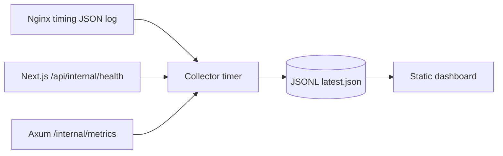

# Lightweight observability on a 1 GB VPS

Prometheus/Grafana-free stack: structured logs, authenticated snapshots, a minute collector, bounded retention, and a static dashboard for future `metrics.gala-soft.ru` cutover.

## Architecture



| Layer | Role | Default |
| --- | --- | --- |
| Nginx `analytics_timing` | Latency/status aggregates | Disabled snippet |
| finance-api JSON logs | systemd journal fields | Enabled |
| `/internal/metrics` | RSS, HTTP, jobs, DB pool | Auth required |
| `/api/internal/health` | Heap/RSS, cache, imports | Auth required |
| Collector | Minute snapshots + retention | systemd disabled |
| Dashboard | Private static UI | Build only |

## Metrics schema (v1)

Schema: `observability/schema/metrics-v1.schema.json`.

**Included:** CPU%, RSS, disk, HTTP latency percentiles, status classes, job queue counts by kind, market cache freshness/size, broker import success/fail counters.

**Excluded:** portfolio payloads, broker HTML, statements, backups, UUIDs, e-mails, idempotency keys, job payload/result JSON.

## Authentication

`Authorization: Bearer $OBSERVABILITY_TOKEN` when set, else HTTP Basic (`ANALYTICS_AUTH_USER` / `ANALYTICS_AUTH_PASSWORD`). Production fails closed without credentials.

## Storage

| Variable | Default |
| --- | --- |
| `OBSERVABILITY_DATA_DIR` | `data/observability` |
| `OBSERVABILITY_MAX_SAMPLES` | `10080` (~7d @ 1/min) |
| `OBSERVABILITY_MAX_JSONL_BYTES` | `5242880` (5 MB) |

```bash
npx tsx observability/collector/run.ts
npm run benchmark:observability
npm run build:metrics-dashboard
```

## Deployment gaps (intentional)

- No DNS for `metrics.gala-soft.ru`
- Nginx vhost/timing snippets ship as `*.disabled`
- Collector systemd units disabled until `OBSERVABILITY_CUTOVER=1`
- TLS for metrics host not provisioned
- No production routing changes in this branch

See `deploy/observability/README.md`.
